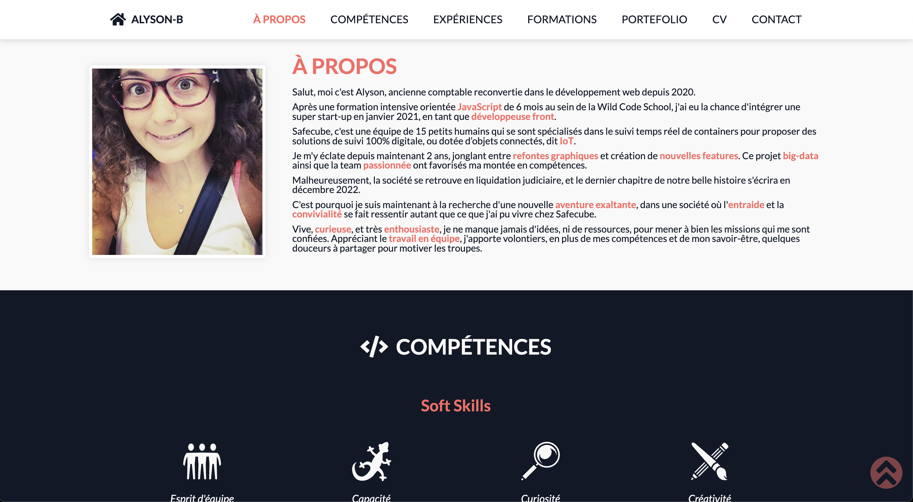

<div align="center">
  
</div>

<h1 align="center">
  alyson-b.fr
</h1>

<p align="center">
  The second iteration of <a href="https://alyson-b.fr" target="_blank">alyson-b.fr</a> built with <a href="https://reactjs.org/.org/" target="_blank">React JS</a> and <a href="https://www.typescriptlang.org/" target="_blank">Typescript</a>
</p>


<a href="https://alyson-b.fr" style="text-align: center">
  
</a>

<p align="center">
    Previous version: <a href="https://github.com/alyson-b69/alyson-b" target="_blank">v1</a>
</p>

## 🛠 Build Setup

```bash
# install dependencies
$ npm install
# serve with hot reload at localhost:3000
$ npm run dev
# build for production and launch server
$ npm run build
$ npm run start
```

## ⚙️ Work with

Server for my contact form : [alysonb-contact](https://github.com/alyson-b69/alysonb-contact)
